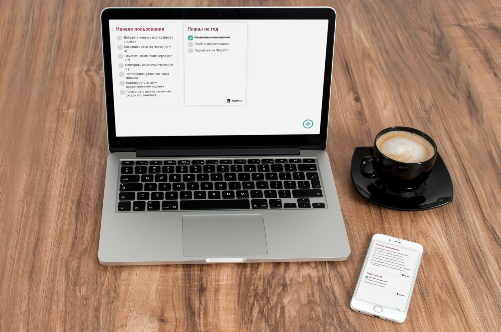
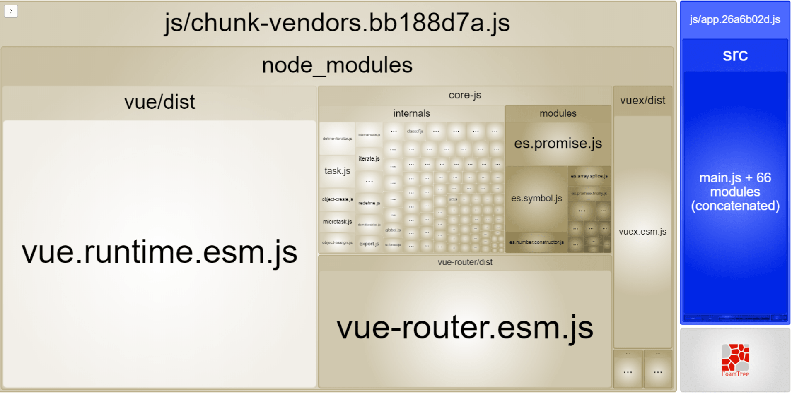

# SPA для ведения заметок 📝




### Установка
```
yarn install
```

### Запуск для разработки
```
yarn serve
```

### Билд
```
yarn build
```

### Что реализовано:

Действия на главной:

- [x] перейти к созданию новой заметки
- [x] перейти к изменению
- [x] удалить (необходимо подтверждение)

Действия с заметкой:

- [x] создать новую заметку
- [x] сохранить изменения
- [x] отменить редактирование (необходимо подтверждение)
- [x] удалить (необходимо подтверждение)
- [x] отменить внесенное изменение
- [x] повторить отмененное изменение


Действия с пунктами Todo:

- [x] добавить
- [x] удалить
- [x] отредактировать текст
- [x] отметить как выполненный

Общее:

- [x] Дизайн и верстка
- [x] Адаптивная верстка
- [x] Отмена действий по ctrl+z
- [x] Повторение действий по ctrl+y
- [x] Сохранение по ctrl+s
- [x] Диалоговые окна должны быть реализованы без использования "alert", "prompt" и "confirm"


Чтобы избежать `/#/` в пути нужно раскомментировать в  `router/router.js`  - `mode: 'history'`


